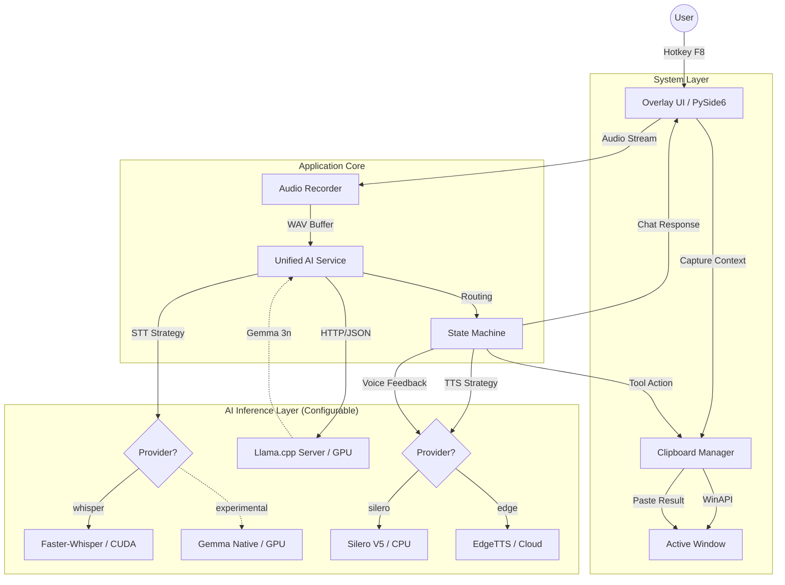

# Magic Paste ✨

> **Интеллектуальный ассистент для "бесшовной" работы с текстом, расширяющий возможности стандартного ввода в любой среде Windows.**


*(Вставьте сюда GIF с демонстрацией работы: Выделение текста -> F8 -> Голосовая команда -> Результат)*

---

## 🚀 О проекте

**Magic Paste** устраняет необходимость постоянного переключения контекста (Copy-Paste-Switch) при работе с LLM. Это оверлейный инструмент, который позволяет редактировать текст, писать код или переводить контент прямо в активном окне (IDE, Браузер, Мессенджер) с помощью голосовых команд.

### Ключевые особенности

- **Zero-Focus UI:** Плавающее окно не отбирает фокус ввода у активного приложения.
- **Глубокая интеграция с ОС:** Использование WinAPI (`ctypes`) для надежного управления буфером обмена и эмуляции ввода.
- **Local-First:** Полная приватность. LLM (Gemma) и STT (Whisper) работают локально на GPU.
- **Мультимодальность:** Поддержка голосового ввода и озвучки ответов (TTS).

---

## 🏗 Архитектура

Проект построен на гибридной архитектуре: Python (UI/Logic) + C++ (High-Performance Inference).



### Технические решения

1. **Unified AI Service:** Единая точка входа для работы с нейросетями. Поддерживает паттерн **Strategy** для переключения провайдеров (например, Whisper vs Native Gemma Audio).
2. **Llama Server Orchestration:** Использование `llama-server.exe` через `subprocess` с управлением жизненным циклом через **Windows Job Objects**. Это гарантирует отсутствие зомби-процессов и утечек VRAM при падении приложения.
3. **Optimized Inference:**
    - **LLM:** Gemma-3n (4-bit quantized) запускается на GPU через `llama.cpp`.
    - **STT:** Faster-Whisper (int8) оптимизирован для CPU, чтобы освободить VRAM для LLM.
    - **Prefix Caching:** Кэширование системного промпта для ускорения отклика.

---

## 🛠 Установка и Запуск

### Требования

- **OS:** Windows 10/11 (x64)
- **GPU:** NVIDIA GeForce RTX 3050 (4GB VRAM) или лучше.
- **Soft:** Python 3.10+, CUDA Toolkit (рекомендуется 12.x).

### 1. Клонирование и зависимости

```bash
git clone https://github.com/iamgm/magic-paste.git
cd magic-paste

# Создание виртуального окружения
python -m venv .venv
.venv\Scripts\activate

# Установка библиотек
pip install -r requirements.txt
```

### 2. Загрузка бинарных файлов и моделей

Проект не хранит большие файлы в репозитории. Их нужно скачать отдельно:

1. **Llama Server:**
    - Скачайте `llama-server.exe` (версия `b46xx` или новее с поддержкой CUDA) из [релизов llama.cpp](https://github.com/ggerganov/llama.cpp/releases).
    - Поместите файл в папку: `src/bin/llama-server.exe`.

2. **Модели (Hugging Face):**
    - Создайте папку `models/`.
    - Скачайте [Gemma-3n-4B-It-GGUF](https://huggingface.co/Iamgm/magic-paste-gemma-3n-4b).
    - *(Экспериментальная опция)* Для Gemma ASR скачайте проектор `mmproj-model-f16.gguf`.

### 3. Конфигурация

Файл `config.yaml` уже настроен по умолчанию. Вы можете изменить:

- `hotkey`: Клавиша активации (default: F8).
- `paste_delay`: Задержка перед вставкой (увеличьте, если ПК медленный).
- `tts.provider`: Выбор голоса (`silero` для оффлайна, `edge` для качественного онлайна).

### 4. Запуск

```bash
python src/main.py
```

---

## 🎮 Как использовать

1. Выделите любой текст в редакторе кода, браузере или Word.
2. Нажмите **F8**. Появится оверлей.
3. Произнесите команду:
    - *Инструмент:* "Переведи на английский", "Найди ошибку в коде", "Сделай текст официальным".
    - *Чат:* "Как дела?", "Расскажи сказку".
4. Отпустите **F8** (или дождитесь тишины, в зависимости от настройки).
5. **Магия:** Результат автоматически заменит выделенный текст или будет озвучен голосом.

---

## 📝 Лицензия

Этот проект распространяется под лицензией MIT. Подробнее см. [LICENSE](LICENSE).

---

**Автор:** Iamgm
**Курс:** Deep Learning (Speech, осень 2025)
